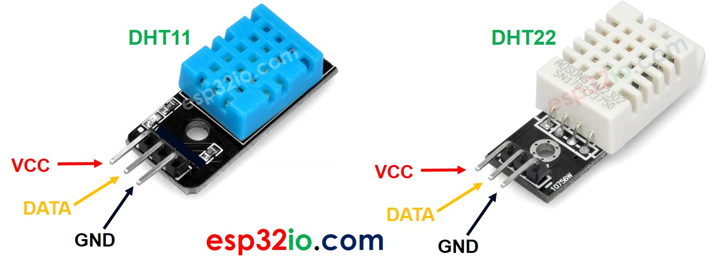

# About Sensor

Please Add Description

[](images/DHT11.jpg)

|  Name | Specification  | 
| :-- | :--- | 
| Operating Voltage	 | 3 to 5V |
| Max Operating Current | 2.5mA max |
| Humidity Range |20-80% / 5% | 
| Temperature Range	| 0-50°C / ± 2°C |
| Sampling Rate	 | 1Hz (reading every second) |

# Minimal Working Code
```cpp
#include "DHT.h"

// defining the signal pin of the DHT11 sensor
#define DHT_PIN 18

//DEFINE THE DHTTYPE eg DHT11, DHT12, DHT22
#define DHT_TYPE DHT11

// Create a DHT object with the parameters mentioned above
DHT dht(DHT_PIN, DHT_TYPE);

void setup() {
  // put your setup code here, to run once:
  Serial.begin(9600);

  dht.begin();

}

void loop() {
  // put your main code here, to run repeatedly:

  // Store temperature value
  float temp = dht.readTemperature();
  // Store humidity value
  float humidity = dht.readHumidity();
  Serial.println(temp);
  Serial.println(humidity);
  delay(1000);

}

```

| Sensor Pin | Board Pin |
| :-- | :-- |
| VCC(+) | 5V |
| OUT | 18 |
| GND(-) | GND pin |
