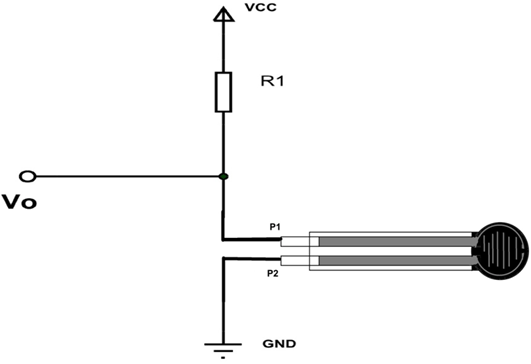

[](images/force-sensor.jpeg)


[](images/force-pinout.png)

# Minimal Working code
```cpp
#include <Arduino.h>
int fsrPin = 15;     // the FSR and 10K pulldown are connected to a0
int fsrReading;     // the analog reading from the FSR resistor divider
 
void setup() {
  Serial.begin(9600);   
}
 
void loop() {
  fsrReading = analogRead(fsrPin);  
 
  Serial.print("Analog reading = ");
  Serial.print(fsrReading);     // the raw analog reading
 
 
  if (fsrReading == 0) {
    Serial.println(" - No pressure");
  } else if (fsrReading < 10) {
    Serial.println(" - Light touch");
  } else if (fsrReading < 50) {
    Serial.println(" - Light squeeze");
  } else if (fsrReading < 150) {
    Serial.println(" - Medium squeeze");
  } else {
    Serial.println(" - Big squeeze");
  }
}
```