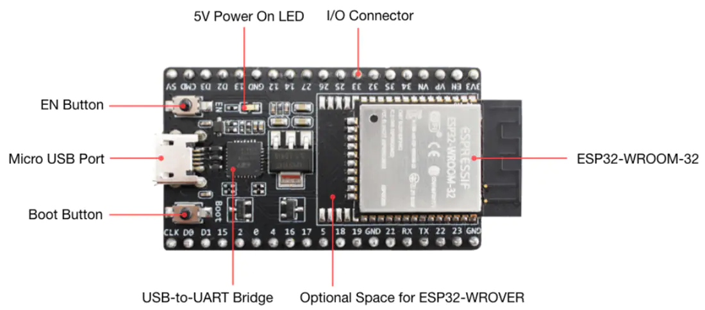
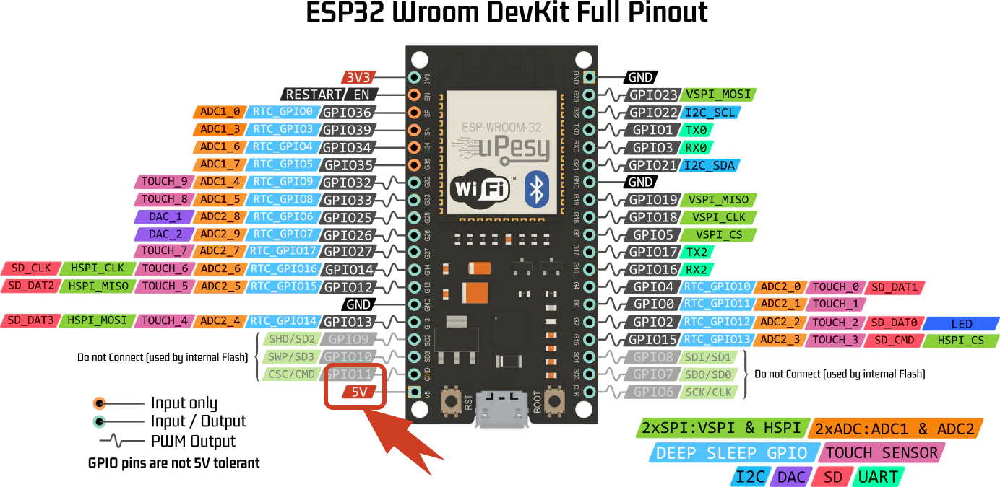

# ESPWROOM32


# Technical features 
| Name | Specification |
| :-- | :--- |
| Microprocessor | Tensilica Xtensa LX6 |
| Maximum Operating Frequency | 240MHz  |
| Operating Voltage | 3.3V |
| Analog Input Pins | 12-bit, 18 Channel |
| DAC Pins | 8-bit, 2 Channel |
| Digital I/O Pins| 	39 (of which 34 is normal GPIO pin) |
| DC Current on I/O Pins | 40 mA |
| DC Current on 3.3V Pin | 50 mA |
| SRAM | 520 KB |
| Communication	 | SPI(4), I2C(2), I2S(2), CAN, UART(3) |
| Wi-Fi | 802.11 b/g/n (speed up to 150Mbps), Supports STA/AP/STA + AP operation mode |
| Bluetooth | V4.2 – Supports BLE and Classic Bluetooth |


# ESP32WROOM PIN-DIAGRAM


# Pins Specifications

| S.NO | PIN CATEGORY | PIN NAME | DETAILS |
| :- | :------------- | :------------------------ | :------------------------------------------- |
| 1 | Power	 | Micro-USB, 3.3V, 5V, GND | VCC and GND pins of the board  |
| 2 | Enable | EN | The pin and the button resets the microcontroller |
| 3 | Analog Pins | ADC1_0 to ADC1_5 and  ADC2_0 to ADC2_9 | Used to measure analog voltage in the range of 0-3.3 and 12-bit 18 Channel ADC |
| 4 | DAC pins | DAC1, DAC2 | 	Used for Digital to analog Conversion |
| 5 | GPIO Pins | GPIO0 to GPIO39 | Can be used as *Input/Output* pins, LOW -> 0V , HIGH -> 3.3V, Pins GPIO34 - GPIO39 Input only |
| 5 | Capacitive Touch pins | T0 to T9 | These can be used a touch pins normally used for capacitive pads. |
| 6 | RTC GPIO pins | RTCIO0 to RTCIO17 | These pins can be used to wake up the ESP32 from deep sleep mode |
| 7 | Serial | RX, TX | Used to receive and transmit TTL serial data |
| 8 | External Interrupts | All GPIO | Any GPIO can be use to trigger an interrupt |  
| 9 | PWM | All GPIO  | 16 independent channel is available for PWM any GPIO can be made to work as PWM though software |
| 10 | VSPI | GPIO23 (MOSI), GPIO19(MISO), GPIO18(CLK) and GPIO5 (CS)  | Used for SPI-1 communication. |
| 11 | HSPI | GPIO13 (MOSI), GPIO12(MISO), GPIO14(CLK) and GPIO15 (CS)  | Used for SPI-2 communication. |
| 12 | IIC | GPIO21(SDA), GPIO22(SCL) | Used for I2C communication |
| 13 | AREF | AREF  | To provide reference voltage for input voltage |

# Issues while uploading code
While uploading code we get this error on both `Windows / Linux` based machines.
```
esptool.py v3.3-dev
Serial port /dev/ttyUSB0
Connecting......................................

A fatal error occurred: Failed to connect to ESP32: Wrong boot mode detected (0x13)! The chip needs to be in download mode.
For troubleshooting steps visit: https://docs.espressif.com/projects/esptool/en/latest/troubleshooting.html
the selected serial port For troubleshooting steps visit: https://docs.espressif.com/projects/esptool/en/latest/troubleshooting.html
 does not exist or your board is not connected
```

This can be solved by holding the `boot` button on the board for a second or so, the chip is now in download mode and is ready for code upload. Example Output of a successful upload
```
esptool.py v3.3-dev
Serial port /dev/ttyUSB0
Connecting...........
Chip is ESP32-D0WDQ6 (revision 1)
Features: WiFi, BT, Dual Core, 240MHz, VRef calibration in efuse, Coding Scheme None
Crystal is 40MHz
MAC: 58:bf:25:9a:6a:4c
Uploading stub...
Running stub...
Stub running...
Changing baud rate to 921600
Changed.
Configuring flash size...
Flash will be erased from 0x00001000 to 0x00005fff...
Flash will be erased from 0x00008000 to 0x00008fff...
Flash will be erased from 0x0000e000 to 0x0000ffff...
Flash will be erased from 0x00010000 to 0x000b6fff...
Flash params set to 0x022f
Compressed 18880 bytes to 12992...
Writing at 0x00001000... (100 %)
Wrote 18880 bytes (12992 compressed) at 0x00001000 in 0.5 seconds (effective 295.5 kbit/s)...
Hash of data verified.
Compressed 3072 bytes to 128...
Writing at 0x00008000... (100 %)
Wrote 3072 bytes (128 compressed) at 0x00008000 in 0.1 seconds (effective 327.6 kbit/s)...
Hash of data verified.
Compressed 8192 bytes to 47...
Writing at 0x0000e000... (100 %)
Wrote 8192 bytes (47 compressed) at 0x0000e000 in 0.2 seconds (effective 436.9 kbit/s)...
Hash of data verified.
Compressed 680864 bytes to 443771...
Writing at 0x00010000... (3 %)
Writing at 0x0001b94f... (7 %)
Writing at 0x000280ef... (10 %)
Writing at 0x0002f0d7... (14 %)
Writing at 0x00034966... (17 %)
Writing at 0x0003a173... (21 %)
Writing at 0x0003f628... (25 %)
Writing at 0x00044749... (28 %)
Writing at 0x000499c1... (32 %)
Writing at 0x0004ed3b... (35 %)
Writing at 0x00053f9c... (39 %)
Writing at 0x00059044... (42 %)
Writing at 0x0005e228... (46 %)
Writing at 0x00063f34... (50 %)
Writing at 0x0006969b... (53 %)
Writing at 0x0006e8f6... (57 %)
Writing at 0x00073cdd... (60 %)
Writing at 0x00078ee7... (64 %)
Writing at 0x0007e566... (67 %)
Writing at 0x00083cee... (71 %)
Writing at 0x00089a41... (75 %)
Writing at 0x0008f562... (78 %)
Writing at 0x00094ceb... (82 %)
Writing at 0x0009e56e... (85 %)
Writing at 0x000a52a2... (89 %)
Writing at 0x000aab51... (92 %)
Writing at 0x000b00af... (96 %)
Writing at 0x000b5b1a... (100 %)
Wrote 680864 bytes (443771 compressed) at 0x00010000 in 6.7 seconds (effective 811.6 kbit/s)...
Hash of data verified.

Leaving...
Hard resetting via RTS pin...
```

Clicking the RST button restarts the board, and the uploaded code starts working.