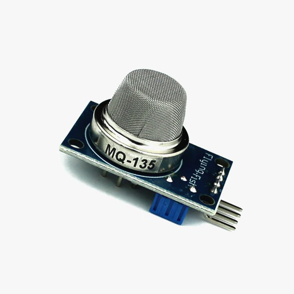
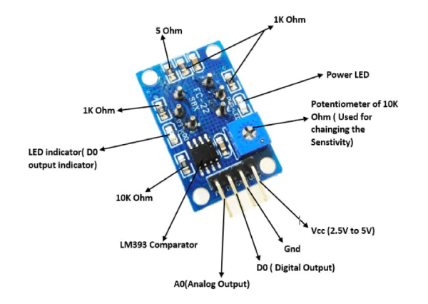
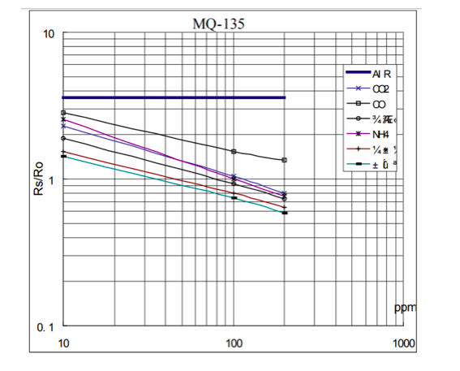

[](images/MQ135.webp)

# Technical Specifications
| Name | Specification |
| :-- | :-- |
| Operating Voltage | 2.5V to 5.0V |
| Power consumption | 150mA |
| Detect/Measure | NH3, Nox, CO2, Alcohol, Benzene, Smoke |
| Typical operating | Voltage: 5V |
| Digital Output | 0V to 5V (TTL Logic ) @ 5V Vcc |
| Analog Output | 0-5V @ 5V Vcc |

[](images/MQ135-Pinout.webp)

# Minimal Code

```cpp
// INCLUDE ALL LIBRARIES
#include <DHT.h>
#include <ESP32Servo.h>
#include <Arduino.h>
#include <WiFi.h>
#include <WiFiMulti.h>
#include <HTTPClient.h>
#include <SPI.h>
#include <Wire.h>
#include <Adafruit_GFX.h>
#include <Adafruit_SSD1306.h>
#include <MQUnifiedsensor.h>

// DEFINE MQ135 to sens CO2
#define placa "ESP-32"
#define Voltage_Resolution 3.3
#define pin 0
#define type "MQ-135"
#define ADC_Bit_Resolution 12
#define RatioMQ135CleanAir 3.6
double CO2 = (0);
MQUnifiedsensor MQ135(placa, Voltage_Resolution, ADC_Bit_Resolution, pin, type);

void setup()
{
    MQ135.setRegressionMethod(1); //_PPM =  a*ratio^b
    MQ135.setA(110.47);
    MQ135.setB(-2.862);
    // Configurate the ecuation values to get NH4 concentration
    MQ135.init();
    Serial.print("Calibrating please wait.");
    float calcR0 = 0;
    for (int i = 1; i <= 10; i++)
    {
        MQ135.update(); // Update data, the arduino will be read the voltage on the analog pin
        calcR0 += MQ135.calibrate(RatioMQ135CleanAir);
        Serial.print(".");
    }
    MQ135.setR0(calcR0 / 10);
    Serial.println("  done!.");
    if (isinf(calcR0))
    {
        Serial.println("Warning: Conection issue founded, R0 is infite (Open circuit detected) please check your wiring and supply");
        while (1)
            ;
    }
    if (calcR0 == 0)
    {
        Serial.println("Warning: Conection issue founded, R0 is zero (Analog pin with short circuit to ground) please check your wiring and supply");
        while (1)
            ;
    }
    /*****************************  MQ CAlibration **************************/
    MQ135.serialDebug(false);
}

void loop()
{

    MQ135.update();           // Update data, the arduino will be read the voltage on the analog pin
    CO2 = MQ135.readSensor(); // Sensor will read CO2 concentration using the model and a and b values setted before or in the setup
    Serial.print("CO2: ");
    Serial.print(CO2);
}

```

| Sensor Pin  | Board Pin  |
| :-- | :-- |
| Analog Output [AO] | 0  |
|  VCC | 5V |
| GND | GND |

<!-- ADD TIP CARD -->
**For more accurate readings it's reccomended to allow the sesnor to burn in for 24/48 hours**

# RS/RO ratio for MQ135 Sensor
[](images/MQ135-measure-gas-PPM.png)

<!-- ADD TIP CARD -->
Above Figure tells us the concentration of a gas in part per million (ppm) according to the resistance ratio of the sensor (RS/R0). RS is the resistance of the sensor that changes depending on the concentration of gas, and R0 is the resistance of the sensor at a known concentration without the presence of other gases, or in fresh air. [[source]](https://jayconsystems.com/blog/understanding-a-gas-sensor#:~:text=RS%20is%20the%20resistance%20of,Law%3A%20V%20%3D%20I%20x%20R)

<!-- NOTE CARD -->

library-required - [MQUnifiedsensor by miguel5612]()