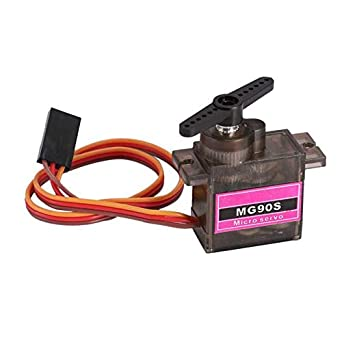
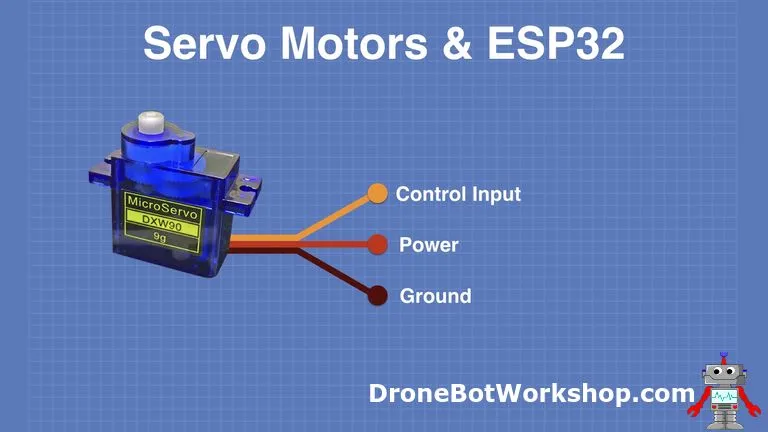

[](images/SERVO.jpg)

# Servo Pinout
[](images/SERVO_PINOUT.webp)

# Minimal Working Code

```cpp
#include "ESP32Servo.h"

#define servo_pin 21


// Create a Servo object
Servo topLid;
void setup() {
  // put your setup code here, to run once:
  
  topLid.attach(servo_pin);

}

void loop() {
  // put your main code here, to run repeatedly:
  while(1){
    topLid.write(0);
    delay(1000);
    topLid.write(90);
    delay(1000);
    topLid.write(0);
    delay(1000);   
  }
}

```

| Servo Pin | Board Pin |
| :-- | :-- |
| VCC | 5V |
| GND | GND |
| Control Input | 21 |

library-required: 	[ESP32Servo by madhephaestus]()